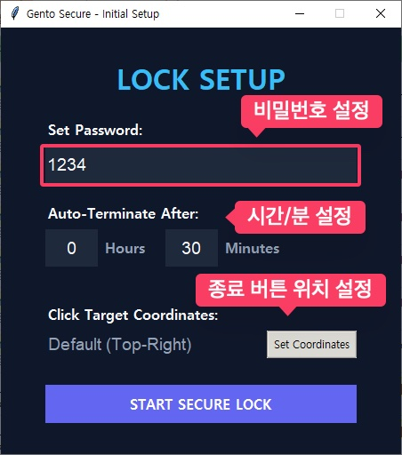
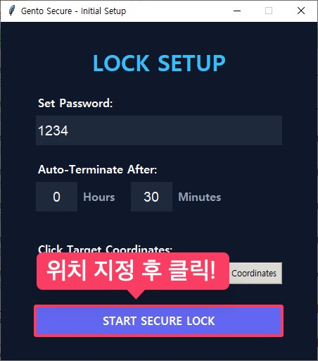
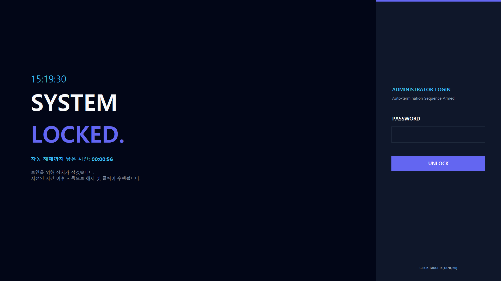

### PC방 화면 보호 및 자동 종료 프로그램

안녕하세요! PC방의 유휴 화면을 안전하게 보호하고, 지정된 시간에 맞춰 자동으로 PC를 종료해주는 스마트한 화면보호기 프로그램이에요.

  

### 사용 방법

1. **비밀번호 설정**: 화면 잠금을 해제할 때 사용할 비밀번호를 숫자만 이용해서 적어주세요.
2. **타이머 지정**: 몇 시간, 몇 분 뒤에 PC를 종료시킬지 원하시는 시간을 설정해 주세요.
3. **종료 버튼 위치 지정**: 자동 종료 시 클릭해야 하는 PC방 사용 종료 버튼의 위치를 마우스로 지정해 주시면 돼요.

`Set Coordinates` 버튼을 누르시면 아래처럼 화면 전체에 투명한 창이 나타나요. 이때 사용 종료 버튼이 있는 위치를 클릭해 주세요!

  

모든 설정을 마쳤다면 `START SECURE LOCK` 버튼을 꾹 눌러주세요!

  

### 화면 잠금 상태

화면보호기가 시작되면 아래와 같은 든든한 잠금 화면이 등장해요. 이 상태에서는 `Alt+Tab`, `Window+Tab`, `Ctrl+Alt+Delete` 같은 시스템 단축키 조작이 철저히 차단되고요, 오직 숫자를 이용한 비밀번호 입력만 가능하답니다.

> **주의해 주세요!**
> 본체 전원 버튼을 물리적으로 눌러서 강제로 끄는 행동까지는 프로그램이 막아드릴 수 없어요!

  

- 화면에는 현재 시간과 종료까지 남은 시간이 실시간으로 표시돼요.
- 설정하신 패스워드를 입력하시면 언제든지 잠금을 해제할 수 있어요.

### 자동 종료

지정해 둔 시간이 모두 지나면, 아래 이미지처럼 설정해 두었던 '사용 종료' 버튼 위치를 마우스가 자동으로 클릭하게 돼요. PC방 관리 프로그램의 '5초 뒤 종료' 기능과 자연스럽게 연동되어 안전하고 깔끔하게 PC가 종료된답니다!

  

